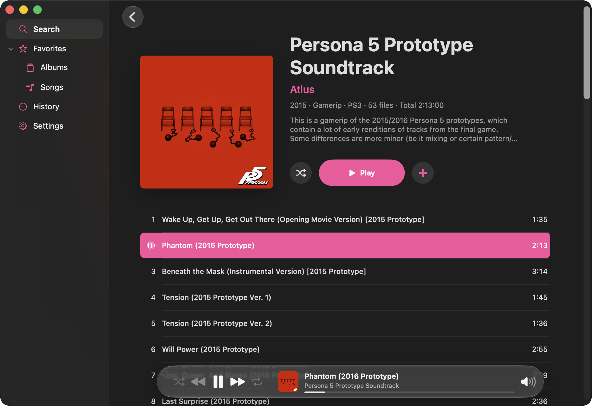

# KHInsider Player for macOS



KHInsider Player is a simple native macOS player for searching KHInsider albums and playing tracks directly.

## Features

- Search albums and play tracks
- Favorite albums and songs
- Keep local playback history
- Cache the currently playing track

## Run

```bash
swift run KHPlayer
```

## Development Checks

```bash
swift build
swift test --disable-swift-testing
bash Tests/BehaviorChecks/run.sh
```

Favorites, playback history, and cache settings are stored locally.
